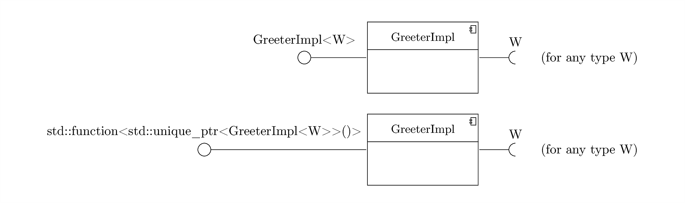
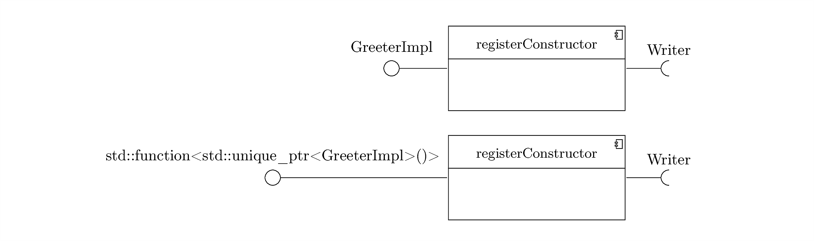
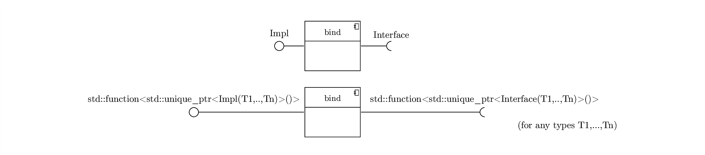
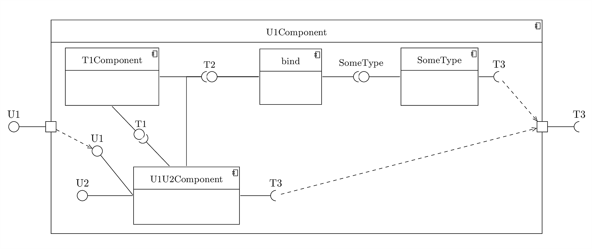
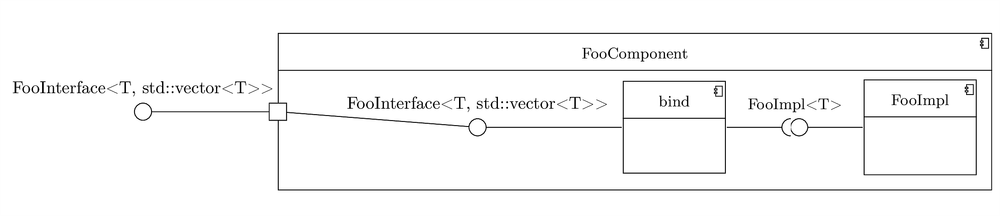
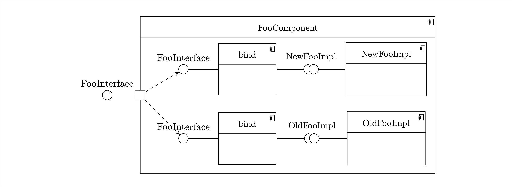

This page is a quick reference for Fruit features, and intended for people that already know the basics of Fruit. If you're just starting to learn Fruit, read the [tutorial](https://github.com/google/fruit/wiki/tutorial:-getting-started) first.

## Constructor injection

#### INJECT macro

The simplest way to define that a class should be injected using a constructor is to wrap the prototype of that constructor in the class definition with the INJECT macro.

    class GreeterImpl : public Greeter {
    private:
        Writer* writer;
    
    public:
        INJECT(GreeterImpl(Writer* writer))
            : writer(writer) {
        }
    
        // ...
    };

    

The constructor can then be defined inside the class definition (as in the snippet above) or just declared there and defined out of the class (for example, in a .cpp file if the class definition is in a header file). If the constructor is defined elsewhere, only the prototype in the class definition should be wrapped in `INJECT()`, the constructor definition shouldn't be.

Note that where constructor injection is desired, even 0-argument constructors must be explicitly registered, whether or not they are user-defined. Fruit never uses a constructor unless that constructor has been explicitly marked as the one that should be used for injection. This is to avoid undesired constructor injection of value types; e.g. if `std::vector<SomeType>` is not bound it's likely that the programmer forgot and Fruit reports an error if this binding is missing, rather than silently constructing an empty vector.

    class StdoutWriter : public Writer {
    public:
        INJECT(StdoutWriter()) = default;
    
        // ...
    };

    

The INJECT macro can only be used when the constructor has a simple signature. It can't be used with any of the following:

*   An explicit `inline` specifier at the point of declaration of the constructor. In this case, the specifier could be removed since for constructors defined in the class definition it's implicit, while for constructors defined outside the class it's the `inline` specifier at the point of definition that counts. However if it's present it interferes with the `INJECT()` macro.
*   Templated constructors
*   Constructors with default values for parameters

Note that the restriction on template is only when the constructor itself is templated. `INJECT()` **can** be used for templated classes, as long as the constructor is not also templated.

    template <typename W>
    class GreeterImpl : public Greeter {
    private:
        W* writer;
    
    public:
        INJECT(GreeterImpl(W* writer))
            : writer(writer) {
        }
    
        // ...
    };

    

The `INJECT()` macro can also be used when only some of the constructor parameters should be injected, see [assisted injection](quick-reference#factories-and-assisted-injection).

#### Inject typedef

When the `INJECT()` macro can't be used (or as an alternative to avoid using macros) an `Inject` typedef can be defined inside the class instead, with the constructor signature. The two examples in the INJECT section can be rewritten as:

    class GreeterImpl : public Greeter {
    private:
        Writer* writer;
    
    public:
        GreeterImpl(Writer* writer)
            : writer(writer) {
        }
    
        typedef GreeterImpl(Writer*) Inject;
        // Or:
        using Inject = GreeterImpl(Writer*);
    
        // ...
    };

    

    class StdoutWriter : public Writer {
    public:
        StdoutWriter() = default; // Optional if no other constructors are defined
    
        typedef StdoutWriter() Inject;
        // Or:
        using Inject = StdoutWriter();
    
        // ...
    };

    

And these are two examples that couldn't be written using the `INJECT()` macro:

    class StdoutWriter : public Writer {
    public:
        StdoutWriter(const char* line_terminator = "\n");
    
        typedef StdoutWriter() Inject;
        // Or:
        using Inject = StdoutWriter();
    
        // ...
    };

    

    class GreeterImpl : public Greeter {
    private:
        Writer* writer;
    
    public:
        template <typename W>
        GreeterImpl(W* writer)
            : writer(writer) {
        }
    
        template <typename W>
        GreeterImpl(std::unique_ptr<W> writer)
            : writer(writer.get()) {
        }
    
        typedef GreeterImpl(Writer*) Inject;
        // Or:
        using Inject = GreeterImpl(Writer*);
    
        // ...
    };

    

In the last example the first templated constructor will be used, with `W`=`Writer`. The usual overloading resolution (with template parameter deduction) is performed to determine the constructor to use for injection.

The `Inject` typedef can also be used when only some of the constructor parameters should be injected, [see assisted injection](quick-reference#factories-and-assisted-injection).

#### registerConstructor()

While the `Inject` typedef doesn't have the limitations of the `INJECT``()` macro, there are some situations where even the typedef is not flexible enough:

*   Can't to modify the class definition. This is typically because the class is a third-party class that is not under our control, and the third-party library doesn't use Fruit. Also, a similar situation would occur if you're trying Fruit in an existing codebase and you want to keep Fruit-specific code separate from the existing code.
*   The class should be injected using that constructor only in some cases. For example, in other cases you want a different constructor for that class, or you want to use a provider instead of constructor injection.

The solution here is the `registerConstructor()` method available when constructing a component.

    class GreeterImpl : public Greeter {
    private:
        Writer* writer;
    
    public:
        GreeterImpl(Writer* writer)
            : writer(writer) {
        }
    
        // ...
    };

    fruit::Component<fruit::Required<Writer>, Greeter> getGreeterComponent() {
        return fruit::createComponent()
            .registerConstructor<GreeterImpl(Writer*)>()
            .bind<Greeter, GreeterImpl>();
    }

    

The `registerConstructor()` alone can be modelled as:

    

If only some of the constructor parameters should be injected, see [the section on assisted injection](quick-reference#factories-and-assisted-injection).

If none of the constructors does the desired initializations, see the [section on providers](quick-reference#providers) to see how to bind a lambda function instead.

## Bindings

`bind<Interface, Impl>()` specifies that `Interface` can be injected from an object of type `Impl`. `Impl` must be a class derived from `Interface`.
It can also bind factories, i.e. bind `std::function<std::unique_ptr<Interface>(T1,...,Tn)>` to `std::function<std::unique_ptr<Impl>(T1,...,Tn)>`, for any parameter types `T1,...,Tn`. See the section on [factories and assisted injection](quick-reference#factories-and-assisted-injection) to see how to bind `std::function<std::unique_ptr<Impl>(T1,...,Tn)>` in the first place.

    

## Multibindings

Multibindings are a feature of Fruit (inspired by Guice) that allows to bind the same type multiple times, in different ways. They can be used to bind plugins, listeners, etc.

Also, since there are no constraints to the number of bindings (even 0 is allowed), they can be used for optional injection: «if T is bound, then get an instance of T and ...», however in this case T must be bound as a multibinding and not as a normal binding. See [lazy injection](quick-reference#lazy-injection) instead if you want something like «if (...) then inject T» with T always bound but expensive to inject.

The multibindings for a given type are completely separate from the normal bindings; in most cases a type will have either multibindings or bindings, but not both.

Multibindings can depend on normal bindings (e.g. using constructor injection) but they can't depend on other multibindings.

Unlike normal bindings, multibindings do **not** contribute to a Component type. E.g. a component with multibindings for Foo and a binding for Bar will have type `fruit::Component<Bar>`, not `fruit::Component<Foo, Bar>`. This allows to add multibindings for any type in any component without exposing this in the component type.

Unlike normal bindings, Fruit will not attempt to remove duplicate multibindings, even if they are "the same multibinding". Because of this, it's a good practice to add multibindings only in the toplevel Component, or in a Component that is close to the toplevel one in the call chain, to avoid unintended duplicates caused by the installation of a Component containing multibindings in multiple places.

Example usage:

    fruit::Component<> getListenerComponent() {
        return fruit::createComponent()
            .addMultibinding<Listener, AListener>()
            .addMultibinding<Listener, SomeOtherListener>();
    }
    
    const std::vector<Listener*>& listeners = injector.getMultibindings<Listener>();
    for (Listener* listener : listeners) {
        listener->notify();
    }

Note that here we specify all multibindings in a single Component, but this is not necessary; Fruit will collect all multibindings in the components used to create the injector.

## Providers

This section is about registering providers. For `fruit::Provider<T>`, see the section on [lazy injection](quick-reference#lazy-injection).

The simplest way to register a class for injection is using constructor injection. However, sometimes there is no constructor that does the desired initialization, and it's not possible to add one (e.g for third-party classes) or it's not reasonable to add one in that class (e.g. for value types, or if the constructor would have to do a too-complex task). In these cases, Fruit allows to construct the object using an arbitrary lambda function.

    class Database {
    public:
        static Database* open(std::string db_name, DbConnectionPool* pool);
    
        void setConnectionTimeout(int seconds);
        ...
    };
    
    fruit::Component<Database> getDatabaseComponent() {
        return fruit::createComponent()
            ... // Bind DbConnectionPool here
            .registerProvider( {
                  Database* db = Database::open("MyDb", pool);
                  db->setConnectionTimeout(12);
                  return db;
            });
    }

    

If the lambda returns a pointer, as in the example above, Fruit will **take ownership** of that pointer and will call `delete` on that object when the injector is destroyed. If you don't want Fruit to take ownership, wrap the pointer in a holder struct or tuple (but note that you'll need to change the places where that type is used) or consider binding an instance.

Instead, if the lambda returns a value, Fruit will move the value into the injector and then only call the class destructor when the injector is destroyed. Note that in this case a memory allocation/deallocation is saved, so it's preferable to return a value if possible.

`registerProvider()` supports only lambdas with no captured variables (aka stateless lambdas). Plain functions are not supported (but you can wrap the function in a lambda).

If you would like to bind a lambda with captures or a user-defined functor, it can still be done with a workaround.

To use this user-defined functor:

    struct Functor {
        Functor(int n) {...}
        MyClass operator()(Foo* foo) {...}
    };

Instead of:

    Component<MyClass> getMyClassComponent() {
        static const Functor aFunctor(42);
        return fruit::createComponent()
            ... // Bind Foo
            // Not allowed !!
            .registerProvider([=aFunctor](Foo* foo) { return aFunctor(foo); });
    }

Write:

    Component<MyClass> getMyClassComponent() {
        static const Functor aFunctor(42);
        return fruit::createComponent()
            ... // Bind Foo
            .bindInstance(aFunctor)
            .registerProvider( { return functor(foo); });
    }

    

## Binding instances

In most cases, it's easier and less bug-prone to let Fruit manage the lifetime of injected objects. However, in some cases it's necessary to give Fruit access to some object external to the injector, and for which Fruit has no ownership.

Binding instances is also a way to bind values that are constant during the lifetime of the injector, but vary between injectors; see the section on [normalized components](quick-reference#normalized-components).

    Foo& getFooInstance() {
        static Foo foo = createFoo();
        return foo;
    }
    
    fruit::Component<Foo> getFooComponent() {
        return fruit::createComponent()
            .bindInstance(getFooInstance());
    }

    

## Annotated injection

There are cases when several implementation types might have the same "natural interface" they implement, except that only one of these types can be bound to it within a single injector. Annotated injection allows to have multiple bindings for the same type and to specify which binding is desired at each point of use. See the [tutorial page](https://github.com/google/fruit/wiki/tutorial:-annotated-injection) for a complete example.

To bind a type using annotated injection, use `fruit::Annotated<MarkerType, T>` instead of `T`, where `MarkerType` is any type you want to use to mark this binding for `T` (typically `MarkerType` is defined as an empty struct, for simplicity).

Example binding:

    class MainBrakeImpl : public Brake {
    public:
        INJECT(MainBrakeImpl()) = default;
      
        // ...
    };
    
    fruit::Component<fruit::Annotated<MainBrake, Brake>> getMainBrakeComponent() {
        return fruit::createComponent()
            .bind<fruit::Annotated<MainBrake, Brake>, MainBrakeImpl>();
    }

Example use:

    class CarImpl : public Car {
    private:
        Brake* mainBrake;
      
    public:
        INJECT(CarImpl(ANNOTATED(MainBrake, Brake*) mainBrake)
            : mainBrake(mainBrake) {
        }
        // Or:
        using Inject = CarImpl(fruit::Annotated<MainBrake, Brake*>);
        CarImpl(Brake* mainBrake)
            : mainBrake(mainBrake) {
        }
      
        // ...
    };

Note that the `ANNOTATED` macro is only meant to be used within `INJECT`. Everywhere else you should write `fruit::Assisted<>` instead, both to define bindings that use annotated injection and to use them.

Fruit supports annotated types instead of plain types everywhere it would make sense to use them (e.g. you can use `ASSISTED` and `ANNOTATED` parameters in the same constructor, you can use an annotated type in `bindInstance`).

The only notable place where you should _not_ use annotated types is to annotate the class type in a constructor:

    class FooImpl : public Foo {
    private:
        Bar* bar;
    public:
        // Error, no need to use ANNOTATED here
        INJECT(ANNOTATED(MyAnnotation, FooImpl)(Bar* bar))
            : bar(bar) {
        }
    };

When auto-injecting a class, Fruit already knows the correct annotation, so providing the annotation here would be redundant.

Another thing to note when using annotated injection is that if you bind an implementation class to an interface using 2 different annotations there will be only _one_ instance of the implementation class:

    class FooImpl : public Foo {
    public:
        INJECT(Foo()) = default;
    };
    
    struct First {};
    struct Second {};
    Component<fruit::Annotated<First, Foo>, fruit::Annotated<Second, Foo>>
        getFooComponent() {
        
        return fruit::createComponent()
            .bind<fruit::Annotated<First, Foo>, FooImpl>()
            .bind<fruit::Annotated<Second, Foo>, FooImpl>(); // Allowed, but misleading!
    }

That's because there is only one instance of every type in an injector (unless that type is annotated with multiple annotations, but `FooImpl` isn't). This is probably not what you want. In this case, you should also annotate the two implementation classes, so that the injector will contain a different instance for each annotation:

    class FooImpl : public Foo {
    public:
        INJECT(Foo()) = default;
    };
    
    struct First {};
    struct Second {};
    Component<fruit::Annotated<First, Foo>, fruit::Annotated<Second, Foo>>
        getFooComponent() {
        
        return fruit::createComponent()
            .bind<fruit::Annotated<First, Foo>, fruit::Annotated<First, FooImpl>>()
            .bind<fruit::Annotated<Second, Foo>, fruit::Annotated<Second, FooImpl>>();
    }

Note that we did not change the definition of `FooImpl`, we only need to specify the annotation in the `bind()` calls. Fruit will then auto-inject `fruit::Annotated<First, FooImpl>` and `fruit::Annotated<Second, FooImpl>`, both using `FooImpl`'s constructor.

## Factories and assisted injection

There are cases when within a single injector, multiple instances of a given class need to be created, either by repeatedly calling a single factory function (e.g. for threads in a thread pool) or because there is no single "correct" instance (different instances are required in different places). Instead of injecting a type `MyClass`, a `std::function<std::unique_ptr<MyClass>()>` or `std::function<std::unique_ptr<MyClass>(T1,...,Tn)>` can be injected instead.

Example factory binding:

    class MyClass {
    public:
        MyClass(Foo* foo, int n);
        ...
    };
    
    Component<std::function<std::unique_ptr<MyClass>(int)>> getMyClassComponent() {
        fruit::createComponent()
            ... // Bind Foo
            .registerFactory<std::unique_ptr<MyClass>(Foo*, fruit::Assisted<int>)>(
                {
                   return std::unique_ptr<MyClass>(new MyClass(foo, n));
               });
    }

    

Example use of the binding from the injector:

    std::function<std::unique_ptr<MyClass>(int)> myClassFactory(injector);
    std::unique_ptr<MyClass> x = myClassFactory(15);

Example use of the binding to inject another class:

    class Bar {
    public:
        INJECT(Bar(std::function<std::unique_ptr<MyClass>(int)> myClassFactory)) {
            std::unique_ptr<MyClass> x = myClassFactory(15);
            ...
        }
    };

    

Note the `fruit::Assisted<>` wrapping the type `int` where `registerFactory()` is called. This allows to distinguish types that should be parameters of the factory ("assisted injection", like `int` in this example) from ones that should be injected by Fruit (normal, non-assisted injection, like `Foo` in this example).

Every call to the factory potentially returns another value; Fruit does not perform any memoization, two calls to `myClassFactory(15)` will return different instances.

If memoization is desired, it can be performed in the lambda passed to `registerFactory()`.

Also, for factories, Fruit does **not** take ownership of the values created by the factory. So it's preferable to return a `std::unique_ptr` in the lambda instead of a plain pointer to give ownership of the object to the caller of the factory.

It's possible to bind factories using `bind<>`, see the [section on bind](quick-reference#bindings) for more info.

In simple cases, where the lambda passed to `registerFactory()` just calls `std::unique_ptr<MyClass>(new MyClass(...))` (as in the example above) the `INJECT()` macro or an `Inject` typedef can be used in the created class itself, instead of writing the `registerFactory()` call explicitly in the component definition.

    class MyClass {
    public:
        INJECT(MyClass(Foo* foo, ASSISTED(int) n));
        ...
    };

    

Note that when using `INJECT()` for assisted injection, the assisted types are wrapped with the `ASSISTED()` macro instead of `fruit::Assisted<>`.

    class MyClass {
    public:
        MyClass(Foo* foo, int n);
    
        using Inject = MyClass(Foo*, fruit::Assisted<int>);
        ...
    };

Instead, if an `Inject` typedef is used, the types that require assisted injection should be wrapped in `fruit::Assisted<>` (as in the original `registerFactory()` call) instead of `ASSISTED()`.

In both cases, the constructor definition (in case the constructor is defined outside the class definition) does **not** need to wrap the types in any way; this is obvious when using the `Inject` typedef, but less obvious when using the `ASSISTED()` macro.

The `INJECT()` macro (and the equivalent Inject typedef) can also be used for factories in the special case when there are `0` assisted arguments; in this case they will bind a type of the form `std::function<std::unique_ptr<MyClass>()>` consistently with the cases with >0 assisted arguments.

## Type of a component, components with requirements and automatic bindings

When using Fruit, every component has a type that declares what type bindings the component exposes and which ones (if any) the component requires.

For example, if a component has type `fruit::Component<fruit::Required<T1, T2, T3>, U1, U2>`, that component exposes the types `U1` and `U2` but requires bindings for `T1`, `T2` and `T3`. In the common case where a component has no requirements, the `fruit::Required<...>` part can be omitted, so we would have just `fruit::Component<U1, U2>` in this case.

When combining components, requirements can be satisfied with a matching binding, or by installing a component that provides those types.

For example:

    fruit::Component<fruit::Required<T1, T2, T3>, U1, U2> getU1U2Component();
    fruit::Component<fruit::Required<T2>, T1> getT1Component();
    
    class SomeType : public T2 {
    public:
        INJECT(SomeType(T3*)) {...}
    };
    
    fruit::Component<fruit::Required<T3>, U1> getU1Component() {
        return fruit::createComponent()
            .install(getU1U2Component()) // Now U1,U2 are provided, T1,T2,T3 are required
            .install(getT1Component()) // Now U1,U2,T1 are provided, T2,T3 are required
            .bind<T2, SomeType>(); // Now U1,U2,T1,T2 are provided, 
                                   // T3,SomeType are required
    }

    

When Fruit compares the provides/requires with the return type of the `getT1Component()` function, it realizes that all types declared to be provided are already provided, but the type `SomeType` is currently required even though it's not declared as required in the resulting Component. At this point Fruit looks for an `Inject` typedef in SomeType (the `INJECT()` macro is just a shorthand for an `Inject` typedef), finds it and adds the binding to the component (automatic binding). Note that in order to add the automatic binding Fruit needs to look at the class definition of `SomeType`. Instead, for other types (e.g. `T3`) Fruit doesn't require the definition, a forward declaration is enough to make the above function compile.

When calculating the required and provided types, Fruit also ensures that there are no dependency loops between bindings and/or components. For example, the following code produces a (compile time) dependency loop error:

    fruit::Component<fruit::Required<T2>, T1> getT1Component();
    fruit::Component<fruit::Required<T1>, T2> getT2Component();
    
    fruit::Component<T1, T2> getT1T2Component() {
        return fruit::createComponent()
            .install(getT1Component())
            .install(getT2Component()); // Error, dependency loop.
    }

    

## Injector

A Fruit injector is an object of type `fruit::Injector<T1,...,Tn>`. Unlike components, injectors can't have requirements. The types `T1,...Tn` are the types exposed by the injector, i.e. the types that can be used in calls to `get<>`. Even though the injector most likely contains bindings for other types, only the types explicitly declared in the injector type can be directly obtained by the injector itself. Other types will be injected as needed using the bindings in the injector, but behind the scenes.

Multibindings behave differently, see the [section on multibindings](quick-reference#multibindings) for more information.

For each type `T` exposed by the injector, the following `get<>` calls are allowed:

*   `injector.get<T>()`
*   `injector.get<T*>()`
*   `injector.get<T&>()`
*   `injector.get<const T*>()`
*   `injector.get<const T&>()`
*   `injector.get<std::shared_ptr<T>>()`
*   `injector.get<fruit::Provider<T>>()`

See the [section on lazy injection](quick-reference#lazy-injection) to see what `fruit::Provider<T>` is; the other types should be clear.

Note that we don't mention any `std::function` here. This is because the injector treats `std::function` as any other type.

If `T` is `std::function<std::unique_ptr<X>(T1,...Tn)>` the above get calls are allowed as for any other `T`. Note that those are allowed for the `std::function` type, but not for `X` itself.

For convenience, the injector also has a conversion operator to all types that can be retrieved from it using `get<>`. For example, this get call:

    MyClass* myClass = injector.get<MyClass*>();

can be abbreviated as:

    MyClass* myClass(injector);

The injector also provides a second `get`-like method: `unsafeGet`. `unsafeGet<T>` can be used to retrieve an instance of any non-interface type `T` bound in the injector, whether or not it's exposed by the injector. It returns a pointer, that is `nullptr` if `T` is not bound in the injector. `unsafeGet` is meant to be used in test code, but **it should not be used in any production code**. The Fruit developers reserve the right of restricting this method when that is required to improve performance of the injector. It originally returned all bound types, and now it no longer works for interfaces; additional restrictions might be added. Limited use in test code is ok if you understand that such code might no longer work with a future release of Fruit, but the use of this method in production code is **strongly discouraged**. Also, having to check whether the returned pointer is `nullptr` turns missing-binding errors from compile time to runtime errors. Whenever possible, you should instead expose the type in the component where it's bound and in all component that install it up to the injector; or if this becomes too verbose for many types, bind a "holder class" in terms of all these types and then expose that holder class in all components up to the injector.

## Normalized components

Normalized components are a feature of Fruit that allows to pre-compute a component that will be used in multiple injectors.

    fruit::Component<fruit::Required<Y>, X> getXComponent(); // Lots of bindings here
    
    int main() {
        fruit::NormalizedComponent<fruit::Required<Y>, X> normalizedComponent(
            getXComponent());
    
        for (...) {
            fruit::Component<Y> yComponent = ...; // Few injector-specific bindings
    
            Injector<X> injector(normalizedComponent, yComponent);
            X* x = injector.get<X*>();
            ...
        }
    }

Constructing an injector from a NormalizedComponent is much faster than constructing it from a Component, because most of the processing (aka normalization) has been done in advance when the Component object was converted to NormalizedComponent. It's also possible to specify some additional bindings at the point where the injector is created; however, this should be limited to very few bindings (<5 is best, <10 is still ok). If too many of these bindings are added, the injector construction can become even slower than it would have been without using the normalized component.

Normalized components are best suited if the vast majority of the bindings are common. A typical use case is in a server, where a separate injector is created for every request, but the bindings of the handler classes are common to all requests; in that case a normalized component can be used, and the request itself (and possibly some metadata about the request) can be added to each injector at the point of construction. See the [section on injection scopes](quick-reference#injection-scopes) for a more detailed example.

## Injection scopes

This section is meant for readers familiar with Guice. If you don't know what injection scopes are, feel free to skip this section.

Unlike Guice, Fruit doesn't have injection scopes. However, Fruit's normalized components can be used in situations where with Guice you would have used injection scopes.

As an example, let's consider a situation in which there are 3 scopes, with the types `X`, `Y` and `Z` part of the three scopes respectively:

    // Outer scope
    class X {
    public:
        INJECT(X()) = default;
        ...
    };
    
    fruit::Component<X> getXComponent() {
        return fruit::createComponent();
    }
    
    // Middle scope
    class Y {
    public:
        INJECT(Y(X* x));
        ...
    };
    
    fruit::Component<fruit::Required<X>, Y> getYComponent() {
        return fruit::createComponent();
    }
    
    // Inner scope
    class Z {
    public:
        INJECT(Z(X* x, Y* y));
        ...
    };
    
    fruit::Component<fruit::Required<X, Y>, Z> getZComponent() {
        return fruit::createComponent();
    }

Then the code that creates the injectors can be written as:

    fruit::NormalizedComponent<X> outerScopeNormalizedComponent(getXComponent());
    fruit::NormalizedComponent<fruit::Required<X>, Y> middleScopeNormalizedComponent(
        getYComponent());
    fruit::NormalizedComponent<fruit::Required<X, Y>, Z> innerScopeNormalizedComponent(
        getZComponent());

    for (...) {
        // We want to enter the outer scope here.
        fruit::Injector<X> outerScopeInjector(
            outerScopeNormalizedComponent, fruit::createComponent());
        fruit::Component<X> xComponent = fruit::createComponent()
            .bindInstance(outerScopeInjector.get<X&>());
        for (...) {
            // We want to enter the middle scope here.
            fruit::Injector<Y> middleScopeInjector(
                middleScopeNormalizedComponent, xComponent);
            fruit::Component<X, Y> xyComponent = fruit::createComponent()
                .install(xComponent)
                .bindInstance(middleScopeInjector.get<Y&>());
                for (...) {
                    // We want to enter the inner scope here.
                    fruit::Injector<Z> innerScopeInjector(
                        innerScopeNormalizedComponent, xyComponent);
                    X* x = innerScopeInjector.get<X*>();
                    Y* y = innerScopeInjector.get<Y*>();
                    Z* z = innerScopeInjector.get<Z*>();
                    ...
                }
        }
    }

The instance of `X` is owned by `outerScopeInjector` so lives for a full iteration of the outer loop. The instance of `Y` is owned by `middleScopeInjector` so lives for an iteration of the middle loop. Finally, the instance of `Z` is owned by `innerScopeInjector` so only lives for an iteration of the inner loop.

See the [section on normalized components](quick-reference#normalized-components) and the [section on bindInstance](quick-reference#binding-instances) if the code above is not clear.

## Eager injection

If you create an injector that will be used concurrently by multiple threads, you either need to synchronize the calls (using a lock) or you might want to inject everything to start with, so that all `get` and `getMultibindings` calls on the injector don't need to modify it (as the objects have already been constructed). The Injector class provides a method to do this: `eagerlyInjectAll()`. After calling this method, the injection can be shared by multiple threads with no locking.

## Lazy injection

Lazy injection is a feature that can be used when a type `Foo` depends on a type `Bar` only for some methods, and `Bar` is expensive to inject; not necessarily because the `Bar` constructor is slow; it might be expensive because it triggers the injection of many other types. In this case, `Foo` can depend on `fruit::Provider<Bar>` instead of directly depending on `Bar`. This delays the injection of `Bar` (and of the types that need to be injected in order to inject the `Bar` object) until the `get` method of the provider is called.

Let's see some example code for this situation:

    class Bar {
    public:
        INJECT(Bar(ReallyExpensiveClass x, SomeOtherReallyExpensiveClass y));
        ...
    };
    
    class Foo {
    private:
        fruit::Provider<Bar> barProvider;
    
    public:
        INJECT(Foo(fruit::Provider<Bar> barProvider))
            : barProvider(barProvider) {
        }
        
        void doSomething() {
            Bar* bar = barProvider.get();
            ...
        }
    };

`Bar`, `ReallyExpensiveClass` and `SomeOtherReallyExpensiveClass` are only injected when `foo->doSomething()` is called, not when `Foo` itself is injected. This can give a sizable performance win if `foo->doSomething()` is not always called.

Every call to `get()` returns the same `Bar` instance, and that's also the same instance that will be used to inject other classes (if there are other classes that depend on `Bar`).

This means that the call to `get()` contains a branch (basically an `if(is_already_initialized)`) so once the `Bar*` has been retrieved you might want to store it in a variable or field instead of calling `get()` multiple times.

## Templated and parametrized components

The `get*Component()` functions are just normal functions; therefore they can be templated:

    template <typename T, typename U>
    class FooInterface { ... };
    
    template <typename T>
    class FooImpl : public FooInterface<T, std::vector<T>> {
    public:
        INJECT(FooImpl()) = default;
        ...
    };
    
    template <typename T>
    fruit::Component<FooInterface<T, std::vector<T>> getFooComponent() {
        return createComponent()
            .bind<FooInterface<T, std::vector<T>>, FooImpl<T>>();
    }

    

And they can parametrized:

    class FooInterface { ... };
    
    class OldFooImpl : public FooInterface {
    public:
        INJECT(OldFooImpl()) = default;
        ...
    };
    
    class NewFooImpl : public FooInterface {
    public:
        INJECT(NewFooImpl()) = default;
        ...
    };
    
    fruit::Component<FooInterface> getFooComponent(bool use_old_impl) {
        if (use_old_impl) {
            return fruit::createComponent()
                .bind<FooInterface, OldFooImpl>();
        } else {
            return fruit::createComponent()
                .bind<FooInterface, NewFooImpl>();
        }
    }

    

The last example also shows how to do conditional injection.
