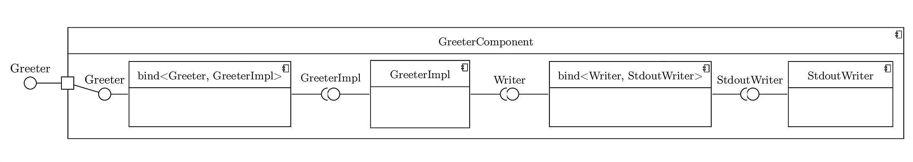
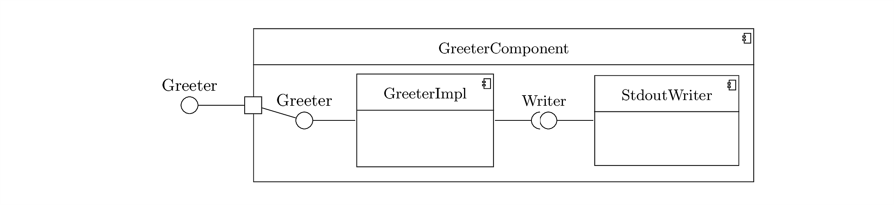

Let's look at a simple example: a Hello world implementation written using Fruit. Using Fruit is probably overkill for
such a simple situation, but it allows us to see the basic features and syntax of Fruit.

    #include <fruit/fruit.h>
    #include <iostream>
    
    class Writer {
    public:
        virtual void write(std::string s) = 0;
    };
    
    class StdoutWriter : public Writer {
    public:
        // Like "StdoutWriter() = default;" but also marks this constructor as the one to use for injection.
        INJECT(StdoutWriter()) = default;
    
        virtual void write(std::string s) override {
          std::cout << s;
        }
    };
    
    class Greeter {
    public:
        virtual void greet() = 0;
    };
    
    class GreeterImpl : public Greeter {
    private:
        Writer* writer;
    
    public:
        // Like "GreeterImpl(Writer* writer) : ... {...}" but also marks this constructor as the one to use for injection.
        INJECT(GreeterImpl(Writer* writer))
            : writer(writer) {
        }
    
        virtual void greet() override {
            writer->write("Hello world!\n");
        }
    };
    
    fruit::Component<Greeter> getGreeterComponent() {
        return fruit::createComponent()
            .bind<Writer, StdoutWriter>()
            .bind<Greeter, GreeterImpl>();
    }
    
    int main() {
        fruit::Injector<Greeter> injector(getGreeterComponent);
        Greeter* greeter = injector.get<Greeter*>();
        greeter->greet();
        return 0;
    }

The structure of the above program can be modelled with the following component diagram.

    

The `StdoutWriter` class requires nothing and provides a `StdoutWriter` instance. The binding between `StdoutWriter` and
`Writer` requires a `StdoutWriter` instance and provides a `Writer` instance. The `GreeterImpl` class requires a
`Writer` instance and provides a `GreeterImpl` instance. The binding between `GreeterImpl` and `Greeter` requires a 
`GreeterImpl` instance and provides a `Greeter` instance. Finally, `GreeterComponent` requires nothing and provides a
`Greeter` instance.

When using Fruit, composite components are typically defined in a `get*Component()` function that starts by creating an
empty component with a call to `fruit::createComponent()`, then uses a chain of operations to add sub-components. Here
we only see the `bind<I, C>()` operation but there are several more. The result of the chain of operations is then
converted with an implicit conversion to the desired component type (in this case, `Component<Greeter>`); during this
conversion Fruit looks for constructors in the bound classes that are wrapped in `INJECT()` and this is how the other
two components above were added. Note that a component does _not_ have to expose all bound interfaces, for example in
this case we haven't exposed the `Writer` interface, and we haven't exposed any implementation classes. An alternative
signature for `getGreeterComponent()` that returns a `Component<Greeter, Writer, GreeterImpl, StdoutWriter>` would also
be allowed.

It's usually useful to hide information on concrete classes, so when a class is bound to an interface the implementation
class is usually not provided. For simplicity, in the rest of the tutorial we'll model the component of the
implementation class together with all the relevant bindings as a single component. The above diagram will then become:

    

In the [next part of the tutorial](https://github.com/google/fruit/wiki/tutorial:-simple-system) we'll see a simple
system built using Fruit.
