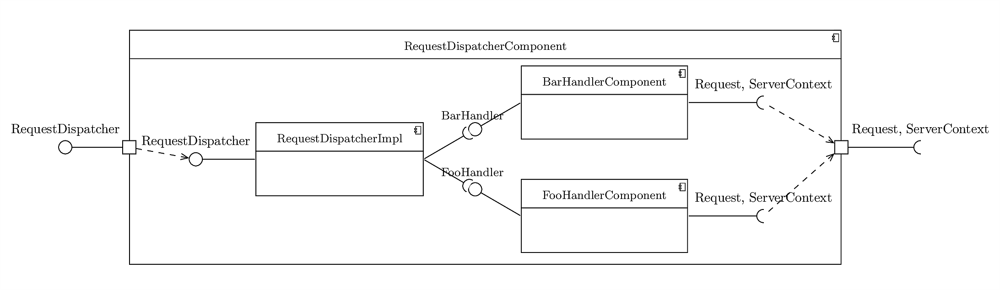
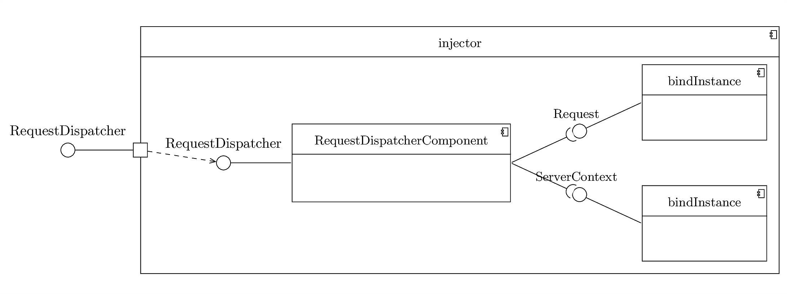
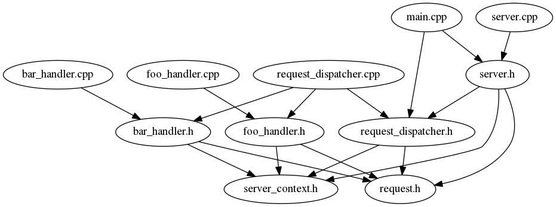

In this chapter of the tutorial, we will see how to use Fruit's normalized components to write an HTTP-like server. We want to write a "server" that reads request URLs from standard input, and dispatches the request to the right handler based on the URL, handling each request in a separate thread.

The full source is available in [examples/server](https://github.com/google/fruit/tree/master/examples/server).

First, let's define the `Request` type. For this simple server, a request is just a URL.

    // request.h
    struct Request {
        std::string path;
    };

We'll also have a `ServerContext` struct, to show how request handlers can access non-request-specific information.

This class is not strictly necessary in our case, but we still use it to show how such information would be passed to the handlers in a real server.

    // server_context.h
    struct ServerContext {
      std::string startupTime;
    };

Now let's write two request handlers: one for URLs starting with `/foo/`:

    // foo_handler.h
    #include "request.h"
    #include "server_context.h"
    
    class FooHandler {
    public:
        // Handles a request for a subpath of "/foo/".
        // The request is injected, no need to pass it directly here.`
        virtual void handleRequest() = 0;
    };
    
    fruit::Component<fruit::Required<Request, ServerContext>, FooHandler> getFooHandlerComponent();

    // foo_handler.cpp
    #include "foo_handler.h"
    
    class FooHandlerImpl : public FooHandler {
    private:
        const Request& request;
        const ServerContext& serverContext;
    
    public:
        INJECT(FooHandlerImpl(const Request& request, const ServerContext& serverContext))
            : request(request), serverContext(serverContext) {
        }
    
        void handleRequest() override {
            cout << "FooHandler handling request on server started at " << serverContext.startupTime << " for path: " << request.path << endl;
        }
    };
    
    Component<Required<Request, ServerContext>, FooHandler> getFooHandlerComponent() {
        return fruit::createComponent()
            .bind<FooHandler, FooHandlerImpl>();
    }

    

And, as you might have expected, one for URLs starting with `/bar/`:

    // bar_handler.h
    #include "request.h"
    #include "server_context.h"
    
    class BarHandler {
    public:
        // Handles a request for a subpath of "/bar/".
        // The request is injected, no need to pass it directly here.
        virtual void handleRequest() = 0;
    };
    
    fruit::Component<fruit::Required<Request, ServerContext>, BarHandler> getBarHandlerComponent();

    // bar_handler.cpp
    #include "bar_handler.h"
    
    class BarHandlerImpl : public BarHandler {
    private:
        const Request& request;
        const ServerContext& serverContext;
    
    public:
        INJECT(BarHandlerImpl(const Request& request, const ServerContext& serverContext))
            : request(request), serverContext(serverContext) {
        }
    
        void handleRequest() override {
            cout << "BarHandler handling request on server started at " << serverContext.startupTime << " for path: " << request.path << endl;
        }
    };
    
    Component<Required<Request, ServerContext>, BarHandler> getBarHandlerComponent() {
        return fruit::createComponent()
            .bind<BarHandler, BarHandlerImpl>();
    }

    

The interfaces of the two components require a `Request` and a `ServerContext` to be bound externally. This approach is more flexible than just passing them as parameter to `handleRequest()` for two reasons: first, `FooHandler` and `BarHandler` don't need to depend on `ServerContext`. Also, this allows them to inject other classes that require `Request` and `ServerContext`, not just to inject `Request` and `ServerContext` themselves.

Now we need a class that dispatches the requests to the right handler:

    // request_dispatcher.h
    #include "request.h"
    #include "server_context.h"
    
    class RequestDispatcher {
    public:
        // Handles the current request.
        // The request is injected, no need to pass it directly here.
        virtual void handleRequest() = 0;
    };
    
    fruit::Component<fruit::Required<Request, ServerContext>, RequestDispatcher> getRequestDispatcherComponent();

    // request_dispatcher.cpp
    #include "request_dispatcher.h"
    
    #include "foo_handler.h"
    #include "bar_handler.h"
    
    class RequestDispatcherImpl : public RequestDispatcher {
    private:
        const Request& request;
        Provider<FooHandler> fooHandler;
        Provider<BarHandler> barHandler;

    public:
        INJECT(RequestDispatcherImpl(
            const Request& request,
            Provider<FooHandler> fooHandler,
            Provider<BarHandler> barHandler))
            : request(request),
              fooHandler(fooHandler),
              barHandler(barHandler) {
        }
    
        void handleRequest() override {
            if (stringStartsWith(request.path, "/foo/")) {
                fooHandler.get()->handleRequest();
            } else if (stringStartsWith(request.path, "/bar/")) {
                barHandler.get()->handleRequest();
            } else {
                cerr << "Error: no handler found for request path: '" << request.path << "' , ignoring request." << endl;
            }
        }
    
    private:
        static bool stringStartsWith(const string& s, const string& candidatePrefix) {
            return s.compare(0, candidatePrefix.size(), candidatePrefix) == 0;
        } 
    };
    
    Component<Required<Request, ServerContext>, RequestDispatcher> getRequestDispatcherComponent() {
        return createComponent()
            .bind<RequestDispatcher, RequestDispatcherImpl>()
            .install(getFooHandlerComponent())
            .install(getBarHandlerComponent());
    }

    

Note that `RequestDispatcherImpl` holds providers of the handlers, not instances. That's because only want to inject the handler that is actually used for the request.
In a large system, there will be many handlers, and many will have lots of dependencies that would also have to be injected.

And now we just need the `Server` class:

    // server.h
    #include "request.h"
    #include "server_context.h"
    #include "request_dispatcher.h"
    
    class Server {
    public:
        virtual void run(fruit::Component<fruit::Required<Request, ServerContext>, RequestDispatcher> requestDispatcherComponent) = 0;
    };
    
    fruit::Component<Server> getServerComponent();

Note that the `run()` method of the server takes a `Component`. This is because we will use two injectors - one for the server startup (that will be used to inject the `Server` instance) and one for each request, that will be used to inject the request dispatcher.

    

    // server.cpp
    #include "server.h"
    
    #include "server_context.h"
    #include "request_dispatcher.h"

    class ServerImpl : public Server {
    private:
        std::vector<std::thread> threads;
    
    public:
        INJECT(ServerImpl()) {
        }
    
        ~ServerImpl() {
            for (std::thread& t : threads) {
              t.join();
            }
        }
    
        void run(Component<Required<Request, ServerContext>, RequestDispatcher> requestDispatcherComponent) override {
            ServerContext serverContext;
            serverContext.startupTime = getTime();
    
            const NormalizedComponent<Required<Request>, RequestDispatcher> requestDispatcherNormalizedComponent(
                createComponent()
                    .install(std::move(requestDispatcherComponent))
                    .bindInstance(serverContext));
    
            cerr << "Server started." << endl;
            
            while (1) {
                cerr << endl;
                cerr << "Enter the request (absolute path starting with "/foo/" or "/bar/"), or an empty line to exit." << endl;
                Request request;
                getline(cin, request.path);
                cerr << "Server received request: " + request.path << endl;
                if (request.path.empty()) {
                    cerr << "Server received empty line, shutting down." << endl;
                    break;
                }
                
                threads.push_back(std::thread(worker_thread_main, std::ref(requestDispatcherNormalizedComponent), request));
            }
        }
   
    private:
        static void worker_thread_main(
            const NormalizedComponent<Required<Request>,
            RequestDispatcher>& requestDispatcherNormalizedComponent,
            Request request) {
    
            Injector<RequestDispatcher> injector(requestDispatcherNormalizedComponent, getRequestComponent(request));
    
            RequestDispatcher* requestDispatcher(injector);
            requestDispatcher->handleRequest();
        }
    
        static string getTime() {
            time_t now = time(nullptr);
            tm* localTime = localtime(&now);
            string result = asctime(localTime);
            if (result.size() != 0 && result.back() == '\n') {
                result.pop_back();
            }
            return result;
        }

        static Component<Request> getRequestComponent(Request request) {
            return createComponent()
                .bindInstance(request);
        }
    };
    
    fruit::Component<Server> getServerComponent() {
        return fruit::createComponent()
            .bind<Server, ServerImpl>();
    }

    

The `run()` method is a main-like method that is called at startup and will only terminate when the server is shut down.

For every request (i.e. a line read from standard input) a new worker thread is created. `worker_thread_main()` creates the injector that will handle the request and calls `RequestDispatcher` to determine the correct handler.
Note the use of `NormalizedComponent` instead of `Component` here. A normalized component is a transformed version of a component from which it's very efficient to create an injector; most of the computation that would otherwise take place when the injector is created is done in advance when the `NormalizedComponent` is created. In this example, this allows the server to do that computation only once, at startup, instead of repeating it in every request.

It's still allowed to add some bindings to a `NormalizedComponent` before creating an injector. This is what happens in `worker_thread_main()`, that has to bind a different `Request` in each injector. The two-argument constructor of `Injector` takes a `NormalizedComponent` and a `Component` and creates an injector with the union of the bindings. Creating an injector for each request is faster than you might expect; look at [the benchmarks page](https://sites.google.com/site/fruitlib/benchmarks) for the details.

Finally, we have the main() functions, that creates the outer injector and calls `Server::run()`.

    // main.cpp
    #include "server.h"
    #include "request_dispatcher.h"
    
    int main() {
        Injector<Server> injector(getServerComponent());
    
        Server* server(injector);
        server->run(getRequestDispatcherComponent());
        
        return 0;
    }

These are the dependencies between the source files:

    

Note that changes to a handler (say, `bar_handler.cpp`) only require recompilation of that translation unit. When adding a handler, we need to recompile the new handler and `request_dispatcher.cpp` (that will likely need changes anyway); we still don't need to recompile the server nor the other handlers, as there's no dependency from `main.cpp` and `server.cpp` to the handlers, not even to their header files.

This concludes the tutorial. Now you should be able to use Fruit effectively.

For more details on each feature of Fruit, see the [Quick reference](quick-reference) or the [FAQ](faq). If something is still unclear, don't hesitate to [send me an email](mailto:poletti.marco@gmail.com).

    

